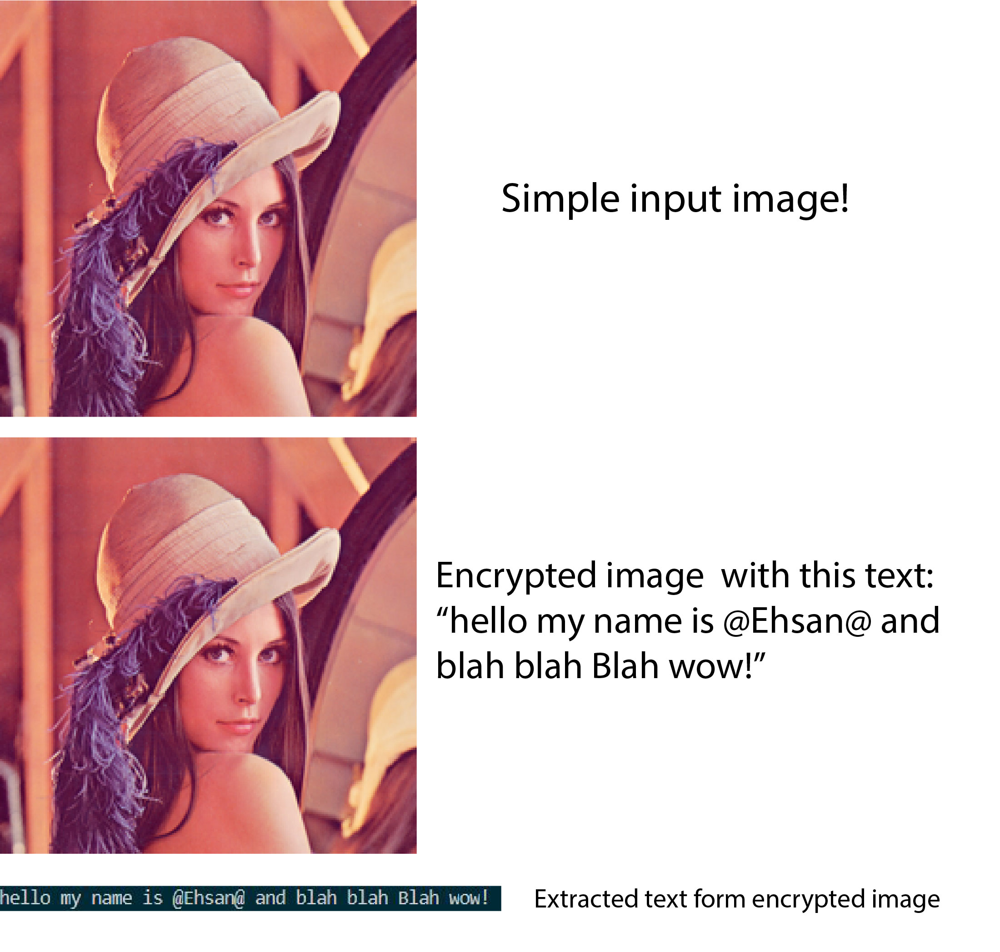

# textHider_inside_picture
```diff
+ Data Hider Inside Picture
```
A project for hiding data and text inside image.</br>
How it works?simply, it converts the data into 8 digit binary mode,then makes an text of binaries of whole text,then saves every two binaries inside the pixels last two less valuable bits!</br>
for better optimization, the size of data is saved in 80 first bits in row(inside 40 pixel's most less 2 bits so 2*40=80).</br>
in decrypt mode, firstly the dycrypt function finds the size of data inside first 80 bits, then reads that size of data!
</br></br>

